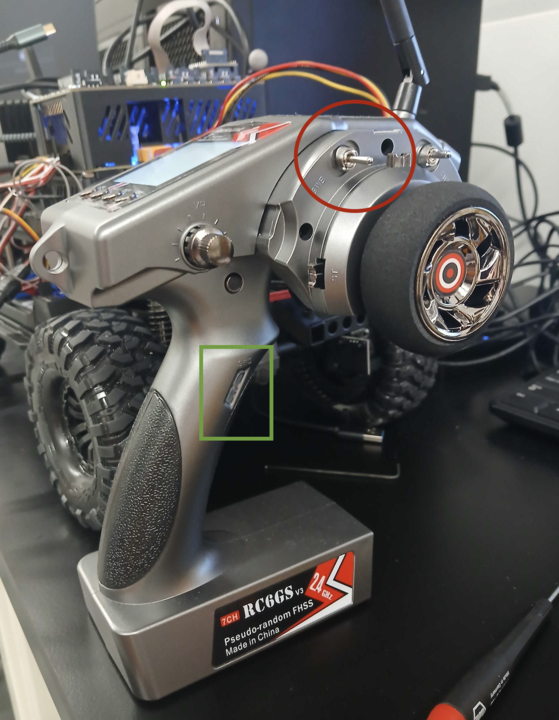
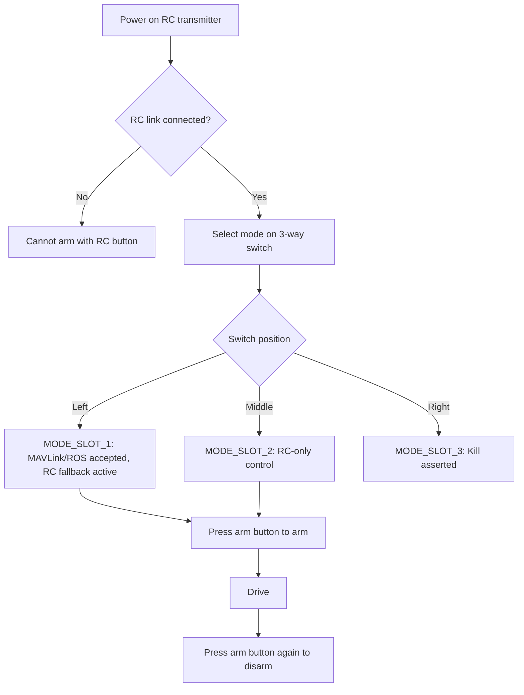

# Controlling the Car (RC and ROS/MAVLink)

## Transmitter Controls

- Green square: arm button (momentary, CH7)
- Red circle: 3-way mode switch (CH5)
  - left: ROS/MAVLink manual control (`MODE_SLOT_1`) with RC fallback
  - middle: RC-only manual control (`MODE_SLOT_2`)
  - right: kill switch position (`MODE_SLOT_3`)



In this image, the 3-way switch is currently in the middle position (RC-only).

## Control Flow



## Arming and Disarming

Board defaults use:

- `RC_MAP_ARM_SW=7`
- `COM_ARM_SWISBTN=1`

So:

- arm: press CH7 arm button once (green-marked button in image)
- disarm: press CH7 arm button once again (same green-marked button)

Note: with this operator flow, the RC receiver must be connected to use button arming.

Quick state check:

```sh
listener actuator_armed 1
```

## Mode Rules in This Fork

- `MANUAL_CONTROL` accepted only in `MODE_SLOT_1`
- `RC_CHANNELS_OVERRIDE` accepted only in `MODE_SLOT_1`
- other mode slots reject MAVLink manual input paths

Source:

- `src/modules/mavlink/mavlink_receiver.cpp`

## MAVLink/ROS Validity Requirement

Manual input validity is timeout-based via `COM_RC_LOSS_T` (seconds).

- valid only while updates arrive within `COM_RC_LOSS_T`
- if updates stop past timeout, MAVLink manual input becomes stale
- in `MODE_SLOT_1`, stale MAVLink input falls back to RC

Board default:

- `COM_RC_LOSS_T=0.5`

Implication:

- theoretical minimum: `>2 Hz`
- practical recommendation: `20 Hz` (`10-20 Hz` minimum)

## Verify ROS `MANUAL_CONTROL` Lands in PX4 (NSH)

If you are not already in NSH, first use:

- [NSH Access Without QGroundControl](troubleshooting.md#nsh-access-without-qgroundcontrol)

1. MAVLink RX path alive:

```sh
mavlink status
```

2. Decoded manual setpoint updates:

```sh
listener manual_control_setpoint 10
```

3. Output path updates:

```sh
listener actuator_servos 10
listener actuator_motors 10
listener actuator_outputs 10
```

4. Gate check:

```sh
listener manual_control_switches 5
```

`mode_slot` must be `MODE_SLOT_1` for MAVLink manual input to be accepted.

## ROS Manual Control Reference

This setup uses MAVLink `MANUAL_CONTROL` through MAVROS topic:

- `/mavros/manual_control/send`

### Switch-Gated Behavior

Authority is selected by CH5 mode switch in PX4 firmware:

- `~1000` (low): accepts MAVLink manual control from ROS
- `~1500` (mid): rejects MAVLink manual control (RC-only)
- `~2000` (high): kill

### Field Mapping and Ranges

For `mavros_msgs/msg/ManualControl`:

- `y`: steering (`-1000..1000`)
- `z`: throttle (`0..1000`, where `500` is neutral)
- `aux1..aux6`: extra manual channels (`-1000..1000`, MAVLink v2 extensions)
- `enabled_extensions`: must enable aux fields (`252` enables `aux1..aux6`)

Publish continuously (`10-20 Hz`) and publish full state every message.
If a later message sets `aux1=0`, output moves to `0` (it does not latch previous `1000`).

### Current Output Mapping (Board Defaults)

PCA9685:

- CH0: throttle (Motor1, function `101`)
- CH1: steering (Servo1, function `201`)
- CH2: RC_AUX1 (function `407`) front diff
- CH3: RC_AUX2 (function `408`) rear diff
- CH4: RC_AUX3 (function `409`) gear
- CH5: RC_AUX4 (function `410`) misc
- CH6: RC_AUX5 (function `411`) misc

Binary endpoints configured for diff/gear:

- CH2/CH3/CH4 min/max = `1200/1800`

### Gear/Diff Polarity

`svea_lli_zephyr` used opposite front/rear differential pulses and inverted gear convention (`high_gear=true` => lower pulse). This setup keeps that semantic:

Diff ON:

- front diff (`aux1`) = `+1000` (high pulse on CH2)
- rear diff (`aux2`) = `-1000` (low pulse on CH3)

Diff OFF:

- front diff (`aux1`) = `-1000`
- rear diff (`aux2`) = `+1000`

Gear HIGH (`high_gear=true`):

- `aux3 = -1000` (low pulse on CH4)

Gear LOW (`high_gear=false`):

- `aux3 = +1000` (high pulse on CH4)

For any binary channel:

- `aux=-1000` -> channel min PWM
- `aux=+1000` -> channel max PWM

### Test Commands

Template with named placeholders:

```sh
STEER=1000           # y: steering (-1000..1000)
THROTTLE=600         # z: throttle (0..1000, 500=neutral)
FRONT_DIFF=1000      # aux1: front diff (-1000..1000)
REAR_DIFF=-1000      # aux2: rear diff (-1000..1000)
GEAR=-1000           # aux3: gear (-1000..1000)
AUX4=0               # aux4: misc servo channel (CH5)
AUX5=0               # aux5: misc servo channel (CH6)
AUX6=0               # aux6: currently unused

ros2 topic pub -r 20 /mavros/manual_control/send mavros_msgs/msg/ManualControl "{x: 0, y: ${STEER}, z: ${THROTTLE}, r: 0, buttons: 0, buttons2: 0, enabled_extensions: 252, s: 0, t: 0, aux1: ${FRONT_DIFF}, aux2: ${REAR_DIFF}, aux3: ${GEAR}, aux4: ${AUX4}, aux5: ${AUX5}, aux6: ${AUX6}}"
```

Steer right, small forward throttle, front diff ON, rear diff OFF, gear HIGH:

```sh
ros2 topic pub -r 20 /mavros/manual_control/send mavros_msgs/msg/ManualControl "{x: 0, y: 1000, z: 600, r: 0, buttons: 0, buttons2: 0, enabled_extensions: 252, s: 0, t: 0, aux1: 1000, aux2: -1000, aux3: -1000, aux4: 0, aux5: 0, aux6: 0}"
```

Neutral steering/throttle, all binary aux set to `-1000`:

```sh
ros2 topic pub -r 20 /mavros/manual_control/send mavros_msgs/msg/ManualControl "{x: 0, y: 0, z: 500, r: 0, buttons: 0, buttons2: 0, enabled_extensions: 252, s: 0, t: 0, aux1: -1000, aux2: -1000, aux3: -1000, aux4: 0, aux5: 0, aux6: 0}"
```

One-shot neutral:

```sh
ros2 topic pub -1 /mavros/manual_control/send mavros_msgs/msg/ManualControl "{x: 0, y: 0, z: 500, r: 0, buttons: 0, buttons2: 0, enabled_extensions: 252, s: 0, t: 0, aux1: -1000, aux2: -1000, aux3: -1000, aux4: 0, aux5: 0, aux6: 0}"
```

For more details, consult the SVEA ROS repository documentation:

- [kth-sml/svea](https://github.com/kth-sml/svea)
