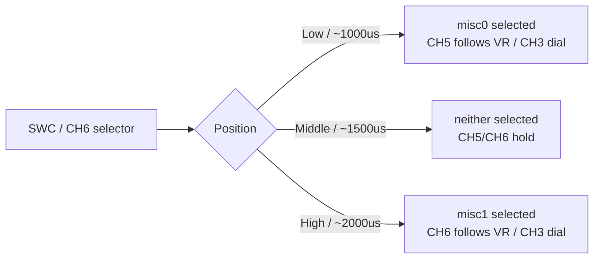

# PMB3: Actuators

## PCA9685 Setup

Expected on I2C bus `2`, addr `0x61`.

```sh
i2cdetect -b 2
pca9685_pwm_out status
```

## Channel Mapping (Current Firmware)

- CH0 `PCA9685_FUNC1` -> throttle (`101`)
- CH1 `PCA9685_FUNC2` -> steering (`201`)
- CH2 `PCA9685_FUNC3` -> front differential (`407`, RC_AUX1)
- CH3 `PCA9685_FUNC4` -> rear differential (`408`, RC_AUX2)
- CH4 `PCA9685_FUNC5` -> gear (`303`, Actuator_Set3)
- CH5 `PCA9685_FUNC6` -> misc0 (`301`, Actuator_Set1)
- CH6 `PCA9685_FUNC7` -> misc1 (`302`, Actuator_Set2)

Notes:

- Diff channels are configured for binary endpoints (`1200/1800`).
- Misc channels are servo-safe by default (`1000/2000` us pulse range).
- Misc channels are driven by `svea_rc_servo_latch`:
  - RC source: SWC / CH6 selects misc0/misc1, VR / CH3 directly drives the selected value, SWA / CH4 toggles gear
  - MAVLink source: `aux4 -> misc0`, `aux5 -> misc1`, `aux3 -> gear`
- Gear initializes to LOW on `svea_rc_servo_latch` start (`+1`, high pulse on CH4).

RC misc selector:



Verify:

```sh
param show PCA9685_FUNC1
param show PCA9685_FUNC2
param show PCA9685_FUNC3
param show PCA9685_FUNC4
param show PCA9685_FUNC5
param show PCA9685_FUNC6
param show PCA9685_FUNC7
param show PCA9685_DUTY_EN
param show PCA9685_MIN6
param show PCA9685_MAX6
param show PCA9685_DIS6
param show PCA9685_MIN7
param show PCA9685_MAX7
param show PCA9685_DIS7
```

## Misc Output Scaling

Both RC and MAVLink commands reach the misc outputs as normalized setpoints:

- RC mode: the VR / CH3 dial is normalized to `-1..1`.
- MAVLink mode: `MANUAL_CONTROL` `aux4` and `aux5` use `-1000..1000`, then PX4 normalizes them to `-1..1`.

The PCA9685 output parameters then map the normalized value to the physical output:

- `-1` / `-1000` -> channel `MIN`
- `0` -> midpoint between `MIN` and `MAX`
- `+1` / `+1000` -> channel `MAX`

With servo-safe defaults for misc0/misc1:

- low dial or `aux=-1000` -> `1000 us`
- center dial or `aux=0` -> `1500 us`
- high dial or `aux=1000` -> `2000 us`

## Optional Full-Duty Misc Outputs

Use this only when misc0/misc1 are connected to something that expects raw duty cycle, not a normal RC servo. In duty mode, `MIN/MAX/DIS` are raw 12-bit PCA9685 counts, not pulse widths in microseconds.

Enable full `0..100%` duty on both misc outputs:

```sh
param set PCA9685_DUTY_EN 96
param set PCA9685_MIN6 0
param set PCA9685_MAX6 4096
param set PCA9685_DIS6 0
param set PCA9685_MIN7 0
param set PCA9685_MAX7 4096
param set PCA9685_DIS7 0
param save
reboot
```

After reboot:

- low dial or `aux=-1000` -> 0% duty
- center dial or `aux=0` -> 50% duty
- high dial or `aux=1000` -> 100% duty

For MAVROS, 0% duty is `aux=-1000`, not `aux=0`. `aux=0` is the midpoint and therefore 50% duty when `MIN/MAX=0/4096`.

MAVROS misc mapping in duty mode:

- `aux4=-1000` -> misc0 0% duty
- `aux4=0` -> misc0 50% duty
- `aux4=1000` -> misc0 100% duty
- `aux5=-1000` -> misc1 0% duty
- `aux5=0` -> misc1 50% duty
- `aux5=1000` -> misc1 100% duty

Example: drive both misc outputs to 0% duty from MAVROS:

```sh
ros2 topic pub -r 20 /mavros/manual_control/send mavros_msgs/msg/ManualControl "{x: 0, y: 0, z: 500, r: 0, buttons: 0, buttons2: 0, enabled_extensions: 252, s: 0, t: 0, aux1: -1000, aux2: 1000, aux3: 1000, aux4: -1000, aux5: -1000, aux6: 0}"
```

Enable full duty for only one misc output:

```sh
# misc0 only: set bit 5 for PCA9685 channel param 6
param set PCA9685_DUTY_EN 32
param set PCA9685_MIN6 0
param set PCA9685_MAX6 4096
param set PCA9685_DIS6 0

# misc1 only: set bit 6 for PCA9685 channel param 7
param set PCA9685_DUTY_EN 64
param set PCA9685_MIN7 0
param set PCA9685_MAX7 4096
param set PCA9685_DIS7 0
param save
reboot
```

These `PCA9685_DUTY_EN` values assume no other PCA9685 channels are intentionally in duty mode. `PCA9685_DUTY_EN` is a bitmask, so preserve any unrelated duty bits if another project has enabled them.

Return both misc outputs to servo-safe pulse mode:

```sh
param set PCA9685_DUTY_EN 0
param set PCA9685_MIN6 1000
param set PCA9685_MAX6 2000
param set PCA9685_DIS6 0
param set PCA9685_MIN7 1000
param set PCA9685_MAX7 2000
param set PCA9685_DIS7 0
param save
reboot
```

Do not connect a normal RC servo to a misc channel while it is configured for full duty mode.

## Manual Disarmed Output Tests

Use `PCA9685_DISx` parameters.

For pulse-width channels, the value is in microseconds. For misc0/misc1 in duty mode, the value is a raw PCA9685 count from `0` to `4096`.

Example steering (CH1 -> `PCA9685_DIS2`):

```sh
param set PCA9685_DIS2 1000
param set PCA9685_DIS2 1500
param set PCA9685_DIS2 2000
```

Mapping:

- CH0 -> `PCA9685_DIS1`
- CH1 -> `PCA9685_DIS2`
- CH2 -> `PCA9685_DIS3`
- CH3 -> `PCA9685_DIS4`
- CH4 -> `PCA9685_DIS5`
- CH5 -> `PCA9685_DIS6`
- CH6 -> `PCA9685_DIS7`

Persist:

```sh
param save
```
