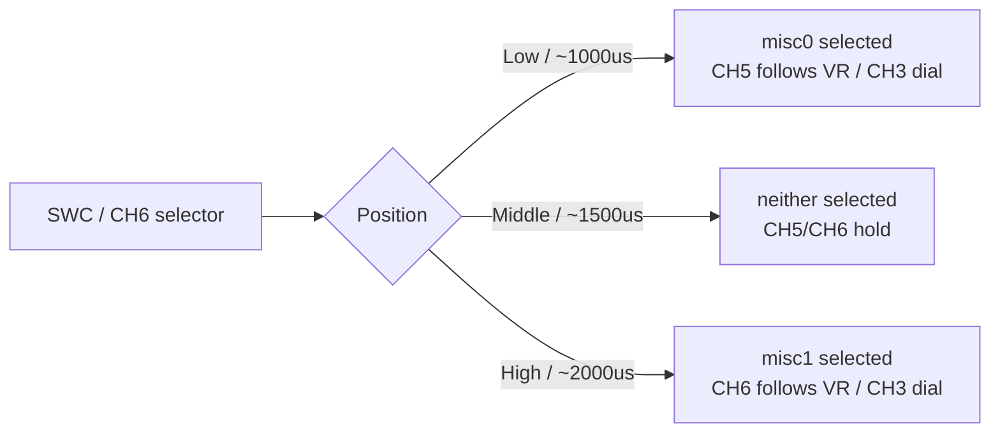

# PMB3: Actuators

## PCA9685 Setup

Expected on I2C bus `2`, addr `0x61`.

```sh
i2cdetect -b 2
pca9685_pwm_out status
```

## Channel Mapping (Current Firmware)

- CH0 `PCA9685_FUNC1` -> throttle (`101`)
- CH1 `PCA9685_FUNC2` -> steering (`201`)
- CH2 `PCA9685_FUNC3` -> front differential (`407`, RC_AUX1)
- CH3 `PCA9685_FUNC4` -> rear differential (`408`, RC_AUX2)
- CH4 `PCA9685_FUNC5` -> gear (`303`, Actuator_Set3)
- CH5 `PCA9685_FUNC6` -> misc0 (`301`, Actuator_Set1)
- CH6 `PCA9685_FUNC7` -> misc1 (`302`, Actuator_Set2)

Notes:

- Diff channels are configured for binary endpoints (`1200/1800`).
- Misc channels are driven by `svea_rc_servo_latch`:
  - RC source: SWC / CH6 selects misc0/misc1, VR / CH3 directly drives the selected value, SWA / CH4 toggles gear
  - MAVLink source: `aux4 -> misc0`, `aux5 -> misc1`, `aux3 -> gear`
- Gear initializes to LOW on `svea_rc_servo_latch` start (`+1`, high pulse on CH4).

RC misc selector:



Verify:

```sh
param show PCA9685_FUNC1
param show PCA9685_FUNC2
param show PCA9685_FUNC3
param show PCA9685_FUNC4
param show PCA9685_FUNC5
param show PCA9685_FUNC6
param show PCA9685_FUNC7
```

## Manual Disarmed Pulse Tests

Use `PCA9685_DISx` parameters.

Example steering (CH1 -> `PCA9685_DIS2`):

```sh
param set PCA9685_DIS2 1000
param set PCA9685_DIS2 1500
param set PCA9685_DIS2 2000
```

Mapping:

- CH0 -> `PCA9685_DIS1`
- CH1 -> `PCA9685_DIS2`
- CH2 -> `PCA9685_DIS3`
- CH3 -> `PCA9685_DIS4`
- CH4 -> `PCA9685_DIS5`
- CH5 -> `PCA9685_DIS6`
- CH6 -> `PCA9685_DIS7`

Persist:

```sh
param save
```
